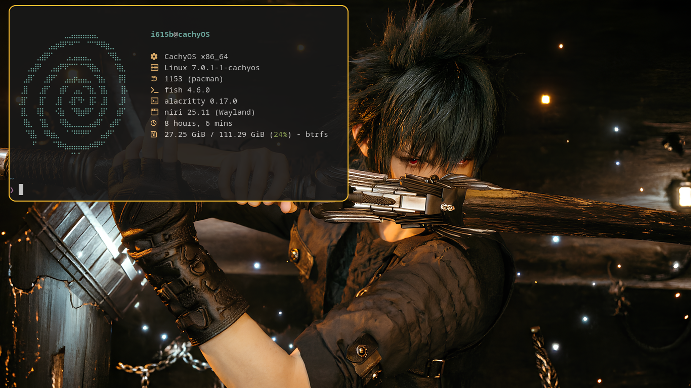
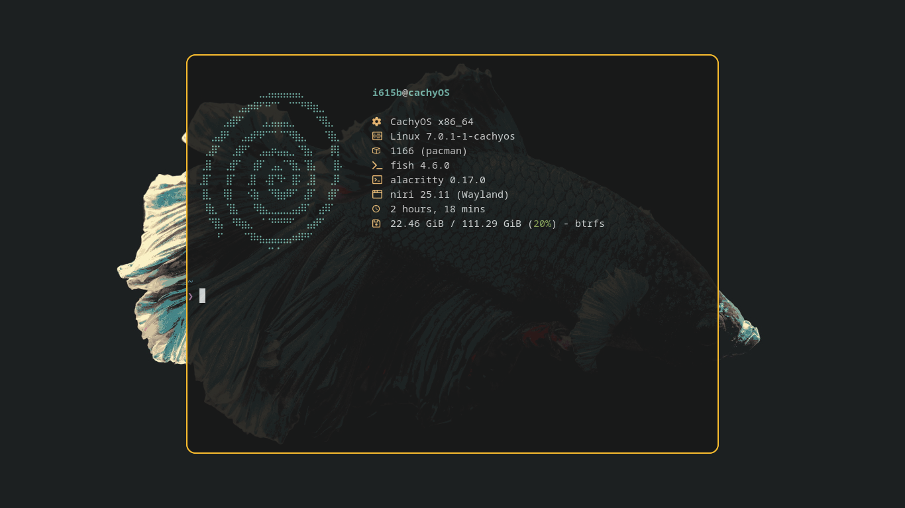
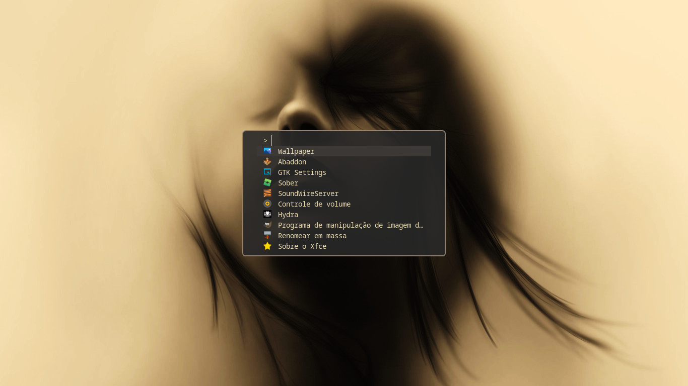
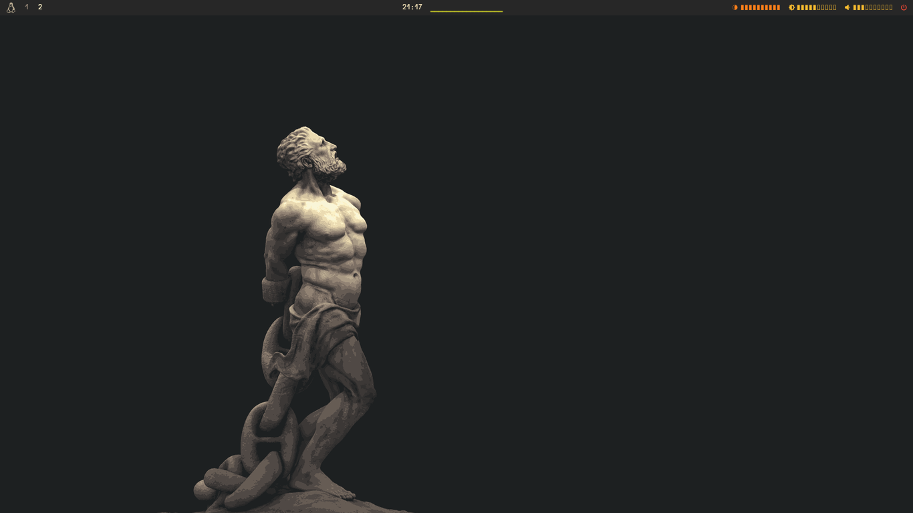

# 󰣇 dotfile-niri

My personal **Niri dotfiles** setup — clean, comfy, and easy to copy.

## 󰋩 Quick look

A simple desktop setup with wallpapers, screenshots, and a ready install script.

| Desktop | Terminal |
|---|---|
|  |  |

| Fuzzel | Alt desktop |
|---|---|
|  |  |

󰈹 **Video preview:** [`screenshots/preview.mp4`](screenshots/preview.mp4)

## 󰙅 What’s inside

- `install.sh` — quick install/setup script
- `screenshots/` — demo images + video
- `Wallpaper/` — wallpapers for this setup

## 󰅐 Install

```bash
chmod +x install.sh
./install.sh
```

## 󰸉 Included wallpapers

- Noctis
- Tux
- Girl
- Cyberpunk
- Minimalistic
- Forest
- Abstract
- QcqKfdZ
- Fish

## 󰒓 Make it yours

Feel free to tweak it however you want:

- swap wallpapers from `Wallpaper/`
- replace screenshots with your own style
- customize `install.sh` for your flow

## 󰀼 Contributing

PRs are welcome.

1. Fork this repo
2. Create your feature branch
3. Open a pull request

## 󰿃 License

No license file yet — add one if you want (MIT is a good default).
