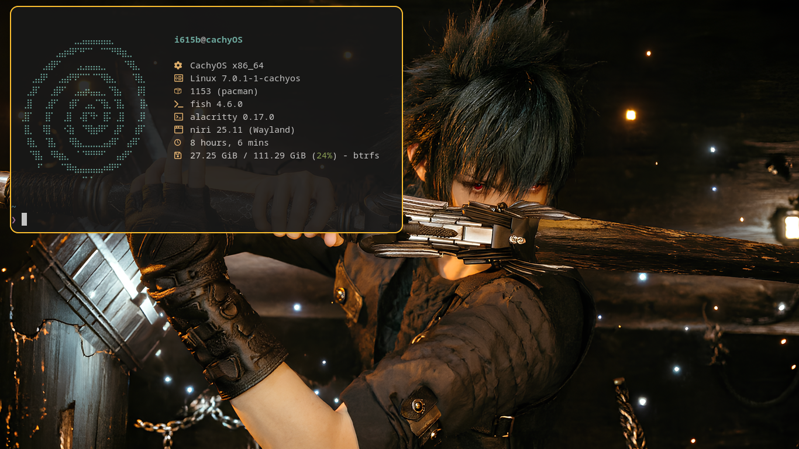
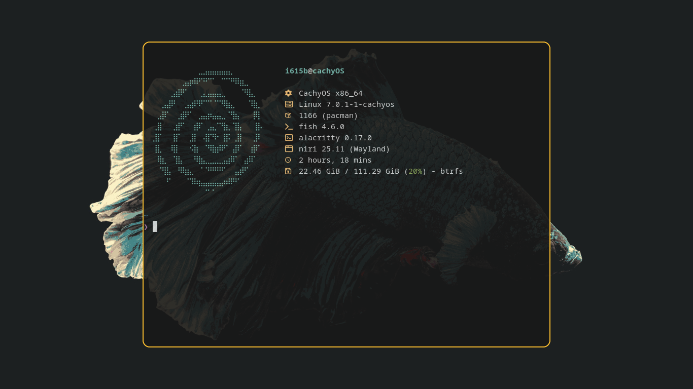
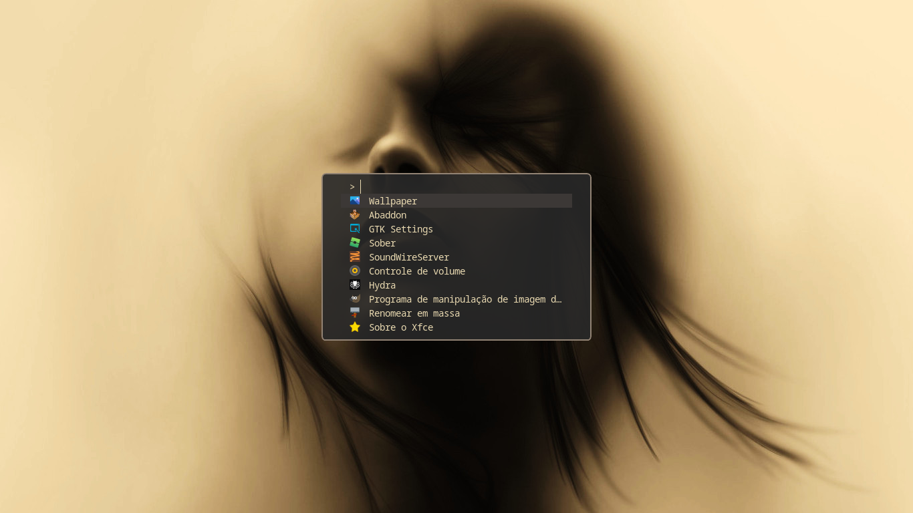
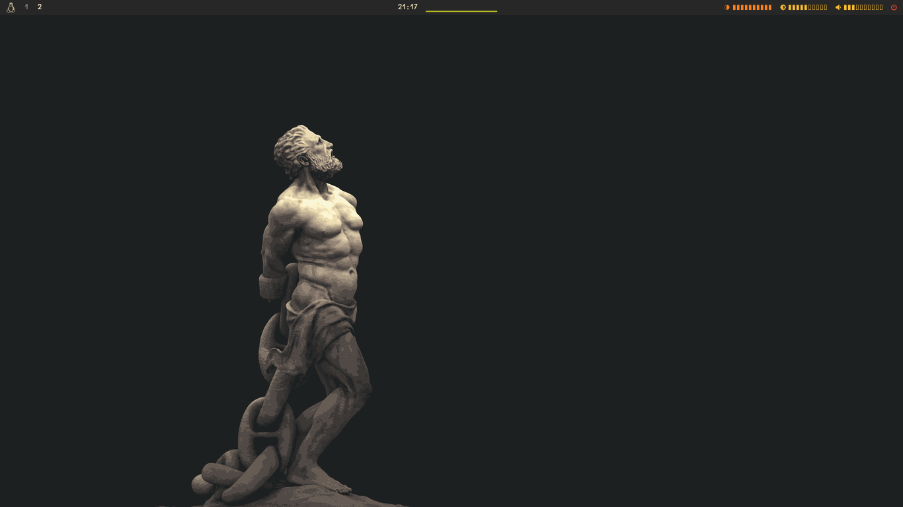

<div align="center">
  
  <h1>Niri Dotfiles</h1>
  <p>A minimal, reproducible Niri (Wayland) desktop setup focused on performance, simplicity, and clean UX.</p>
</div>

<p align="center">
  <a href="#installation"></a>
  <a href="https://github.com/l7p3x/dotfile-niri/stargazers"></a>
</p>

---

## Overview

**Niri Dotfiles** provides a complete Wayland environment (Niri + Waybar + Fuzzel + Mako), a modular install script with bootstrap, update, and rollback support, optional symlink-based deployment for easy maintenance, and a clean and lightweight workflow optimized for low-resource systems.

It features a minimal setup focused on performance, simplicity, and clean UX that keeps the system fast and easy to maintain across different machines.

## Features

- **Fast**: Minimal overhead for maximum performance.
- **Minimal**: Only the essential tools for a productive environment.
- **Reproducible**: Easy to deploy across different machines.
- **Modifiable**: Simple structure that is easy to understand and tweak.

### Preview

<div align="center">

| Desktop | Terminal |
|---|---|
|  |  |
| Fuzzel | Alt desktop |
|---|---|
|  |  |

</div>

Video: [`screenshots/preview.mp4`](screenshots/preview.mp4)

## Installation

### 1. Clone the Repository
```bash
git clone https://github.com/l7p3x/dotfile-niri.git ~/.local/share/dotfile-niri
cd ~/.local/share/dotfile-niri
./install.sh
```
Default behavior: bootstrap + install.

### 2. Deployment Modes

The installer can deploy files in two modes:
- **default**: copies files to your `$HOME`
- **--symlink**: symlinks files from this repo into your `$HOME` (do not move or delete the repo folder after installation).

### 3. Installer Commands

| Command | Description |
| :--- | :--- |
| `(none)` | Full auto: bootstrap + install |
| `bootstrap` | Install base system from scratch |
| `install` | Deploy dotfiles |
| `update` | Re-deploy only changed files |
| `rollback` | Restore last backed-up files |
| `status` | Show current install state |

```bash
./install.sh --help
```

**Options:**
- `--install-packages`: Install packages via yay/pacman
- `--symlink`: Use symlinks instead of copies
- `--no-backup`: Skip backup
- `--dry-run`: Show actions without changing anything
- `--force`: Ignore install lock
- `--yes`: Non-interactive mode
- `--profile=NAME`: Use a profile name

### 4. Quick Examples

```bash
# Full setup
./install.sh

# Only bootstrap dependencies
./install.sh bootstrap

# Install configs with symlinks
./install.sh install --symlink

# Update after pulling new changes
git pull
./install.sh update

# Check current state
./install.sh status

# Rollback backups created during deploy
./install.sh rollback
```

### 5. Manual Installation
```bash
# 1. Install core dependencies (Niri, Waybar, Fuzzel, Mako, Fish, Alacritty, Thunar, fonts, etc.)
# 2. Copy or symlink this repo's .config/ entries to ~/.config/
# 3. Copy or symlink .local/bin/ scripts to ~/.local/bin/
# 4. Copy .local/share/applications/, .local/share/icons/, and .local/share/fonts/ into your local share directory.
# 5. Log out and log back in.
```

## Customization

*Looking for advanced tweaks?*
Animations, layout, and behavior require editing the config files directly inside `.config/niri/`.

## Directory Structure

```text
.
├── .config/          # App configs (niri, waybar, fish, mako, fuzzel, alacritty, etc.)
├── .local/
│   ├── bin/          # Helper scripts
│   └── share/        # Local desktop assets (icons, desktop files, fonts)
├── Wallpaper/
├── screenshots/
├── install.sh
└── README.md
```

## Dependencies

**Core:**
- niri
- waybar
- fuzzel
- mako

**Utilities:**
- fish
- alacritty
- thunar

## Uninstallation

To remove the dotfiles, delete the repo and restore your previous configs:

```bash
rm -rf ~/.local/share/dotfile-niri
```
Then use `rollback` if you ran the installer, or manually restore your previous `~/.config` entries.
